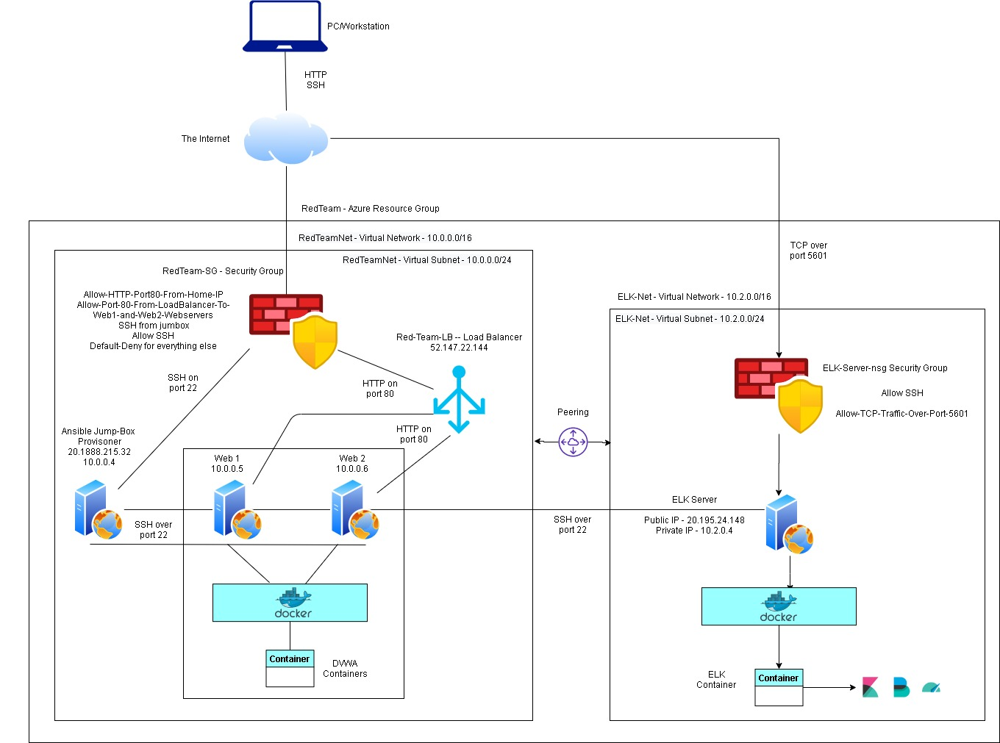

# ELK-Project__Cyber-Bootcamp

## Automated ELK Stack Deployment

The files in this repository were used to configure the network depicted below.

These files have been tested and used to generate a live ELK deployment on Azure. They can be used to either recreate the entire deployment pictured above. Alternatively, select portions of the ansible playbook file may be used to install only certain pieces of it, such as Filebeat.

* [Ansible Docker Configuration Playbook](Yaml/docker-config-playbook.yml)
* [Ansible Hosts File](Yaml/hosts)
* [ELK Installation Playbook](Yaml/install-elk.yml)
* [Metricbeat Configuration File](Yaml/metricbeat-config.yml)
* [Metricbeat Playbook](Yaml/metricbeat-playbook.yml)
* [Filebeat Configuration File](Yaml/filebeat-config.yml)
* [Filebeat Playbook](Yaml/filebeat-playbook.yml)

This document contains the following details:
- Description of the Topology
- Access Policies
- ELK Configuration
  - Beats in Use
  - Machines Being Monitored
- How to Use the Ansible Build

### Description of the Topology

The main purpose of this network is to expose a load-balanced and monitored instance of DVWA, the D*mn Vulnerable Web Application.

Load balancing ensures that the application will be highly redundant and available, in addition to restricting access to the network.
A load balancer particularly protects an organisation against distributed denial of service attacks by allowing for any and all attack traffic to be shifted or sent elsewhere, either to backup servers or to a public cloud provider.  

A jump box serves to provide a controlled and monitored means of access between the two security zones. In order for any updates or tasks to be completed on the web servers and ELK server, an administrator must first login through the jump box inorder to gain access. This increases security and allows for network engineers to focus on hardening the network around a singular machine. 

Integrating an ELK server allows users to easily monitor the vulnerable VMs for changes to the network and system traffic.
Configured within the ELK server are the filebeats and metribeats tools. Filebeats serves as a lightweight solution for data collection. In particular in collects log files from the various servers it is configured to and sends them to a centeral location known as Elasticsearch where the data can be further processed and enhanced. It eliminates the slow and tiredsome process of having to SSH into each and every server, virtual machine and container to collect all the generated logs. Similarily metricbeats is used to periodically collect system metrics and statistics like CPU usage, memory, file system, disk IO and all other processes running, and sends it to ELasticsearch for easy lookup and analysis.  

The configuration details of each machine may be found below.

| Name                 | Function       | IP Address             | Operating System |
|----------------------|----------------|------------------------|------------------|
| Jump-Box Provisione- | Gateway        | 10.0.0.4/20.188.215.32 | Linux            |
| Load Balancer        | Load Balancer  | 52.147.22.144          | Linux            |
| ELK-Server           | Elk Server     | 10.2.0.4/20.195.24.148 | Linux            |
| Web-1                | Web Server     | 10.0.0.5               | Linux            |
| Web-2                | Web Server     | 10.0.0.6               | Linux            |
| Home-PC              | Access Control | Dynamic IP             | Windows          |

### Access Policies

The machines on the internal network are not exposed to the public Internet. 

Only the _ELK Server_ machine can accept connections from the Internet. Access to this machine is only allowed from the following IP addresses:
* Personal PC with Dynamic Public IPV4 address.

Machines within the network can only be accessed by the _personal pc_ and/or the _jump-box-provisioner._
Similarily the ELK server could only be accessed by these two machine. The _jump-box-provisioner_ was able to access the ELK server via SSH on port 22 while the _personal pc_ was able to access it via TCP through port 5601.

A summary of the access policies in place can be found in the table below.

| Name                 | Publicly Accessible | Allowed IP Addresses                                |
|----------------------|---------------------|-----------------------------------------------------|
| Jump Box Provisioner | No                  | Personal PC Dynamic IPv4 Address                       |
| Web 1                | No                  | 10.0.0.4 - Jump Box,52.147.22.144 - Load Balancer   |
| Web 2                | No                  | 10.0.0.4 - Jump Box,52.147.22.144 - Load Balancer   |
| ELK Server           | No                  | 10.0.0.4 - Jump Box                                 |
| Load Balancer        | No                  | Personal PC Public IP                               |

### Elk Configuration

Ansible was used to automate configuration of the ELK machine. No configuration was performed manually, which is advantageous because it helps to eliviate the drudgery workload while allowing for the deployment of multiple servers quickly and efficently.

The playbook implements the following tasks:
- Increases the virtual memory 
- Installs Docker
- Installs pip3
- Installs a Python Docker module
- Downloads and launches a Docker ELK container
- Exposes the container to ports:
- - 5601
- - 9200
- - 5044

The following screenshot displays the result of running `docker ps` after successfully configuring the ELK instance.

### Target Machines & Beats
This ELK server is configured to monitor the following machines:
- _TODO: List the IP addresses of the machines you are monitoring_

We have installed the following Beats on these machines:
- _TODO: Specify which Beats you successfully installed_

These Beats allow us to collect the following information from each machine:
- _TODO: In 1-2 sentences, explain what kind of data each beat collects, and provide 1 example of what you expect to see. E.g., `Winlogbeat` collects Windows logs, which we use to track user logon events, etc._

### Using the Playbook
In order to use the playbook, you will need to have an Ansible control node already configured. Assuming you have such a control node provisioned: 

SSH into the control node and follow the steps below:
- Copy the _____ file to _____.
- Update the _____ file to include...
- Run the playbook, and navigate to ____ to check that the installation worked as expected.

_TODO: Answer the following questions to fill in the blanks:_
- _Which file is the playbook? Where do you copy it?_
- _Which file do you update to make Ansible run the playbook on a specific machine? How do I specify which machine to install the ELK server on versus which to install Filebeat on?_
- _Which URL do you navigate to in order to check that the ELK server is running?

_As a **Bonus**, provide the specific commands the user will need to run to download the playbook, update the files, etc._
